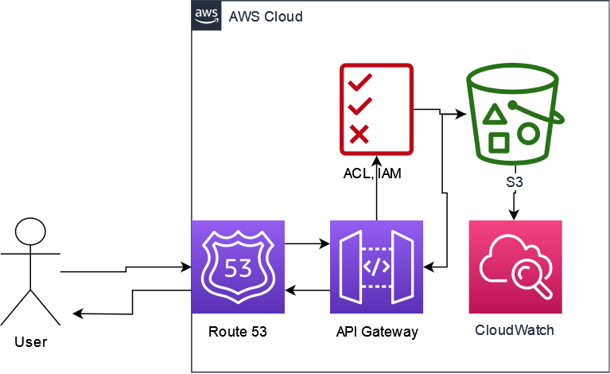

# Dana_Farber_assessment
This file will serve as the navigator for the entire assessment. You can view the results of each implementation through the links provided.

Before starting, please clone the entire repository to your local machine:
```
cd ~
git clone https://github.com/LiangA/Dana_Farber_assessment.git
cd  Dana_Farber_assessment
```
Put the corresponding test data into this folder, and you can start playing with the project.

## BioInformatics & Data Handling
I used Python 3.11.2 for development, but you should be able to run it smoothly with any version of Python 3.7 or above. This assessment does not require any additional installation of packages.

For each task, the same report.py file is used for processing, and each task has a corresponding mode and required parameters. Please refer to the following instructions or enter the following command:
```python 
python report.py --help
```
and read the document.

### Task 1-1
> Recursively find all FASTQ files in a directory and report each file name and the percent of sequences in that file that are greater than 30 nucleotides long.
The input is a directory contains at least one fastq file in it.

You must use the following command to perform the test:
你必須使用以下指令來進行測試:
```python
python report.py --mode fastq --fq <directory>
```
You will see output similar to the following:
```
alden@DESKTOP-PTP549K:~/dana_farber_assessment$ python report.py --mode fastq --fq ./sample_files/
2023-05-04 01:55:05 root INFO starting function assign_files ...
2023-05-04 01:55:05 root INFO starting function check_assigned_file_format ...
2023-05-04 01:55:05 root INFO starting function divide_files ...
2023-05-04 01:55:05 root INFO starting function map ...
2023-05-04 01:55:05 root INFO starting function reduce ...
2023-05-04 01:55:05 root INFO starting function build ...

The percent of sequences are greater than 30 nucleotides long for each file:
Sample_R1.fastq: 80.6424%
Sample_R2.fastq: 83.6010%
```
> Note: --fq can also be replaced with --fastq-directory

### Task 1-2
> Given a FASTA file with DNA sequences, find 10 most frequent sequences and return the sequence and their counts in the file.
The input is a directory(file path) of a fasta file.

You must use the following command to perform the test:
```python
python report.py --mode fasta --fa <directory>
```
You will see output similar to the following:
```
alden@DESKTOP-PTP549K:~/dana_farber_assessment$ python report.py --mode fasta --fa ./sample_files/fasta/sample.fasta 
2023-05-04 02:00:04 root INFO starting function assign_files ...
2023-05-04 02:00:04 root INFO starting function check_assigned_file_format ...
2023-05-04 02:00:04 root INFO starting function divide_files ...
2023-05-04 02:00:04 root INFO starting function map ...
2023-05-04 02:00:04 root INFO starting function reduce ...
2023-05-04 02:00:04 root INFO starting function build ...

10 most frequent sequences and their counts in the file:
CGCGCAGGCTGAAGTAGTTACGCCCCTGTAAAGGAATCTATGGACAATGGAACGAACA: 28
TGTTCTGAGTCAAATGATATTAACTATGCTTATCACATATTATAAAAGACCGTGGACATTCATCTTTAGTGTGTCTCCCTCTTCCTACT: 27
CTCAATCTGCCAAGACCATAGATCCTCTCTTACTGTCAGCTCATCCGGTGAGGCC: 22
CCTGTTGCTGACTCAAGACATTAGTGAGAAATAAGACTTCTGCGATGCTCACCACTGCAATTGCTCATGCAAAATTGCGTTTAACAGG: 21
TTTCAGCTGTCTTTTAAGCAGAAGCGATTTGTCCAACAAAAACAACGCTGTTTACGAA: 17
ATTGCGAATTCCGCCTGTGTCCCCCACACGAGCGTGAATCGTGGCTAGAAGTTCAGCCCCTCTTAGCACAGAGTGAG: 17
TCACGCAGACAACGAACTGTGTCTGGATCAAAGACATCCGATAAGGCGATTCGTCTAGAAGGGTTACACAGTTGGGACCGGTAG: 8
GACACAAACACCGTGGCTCAACCTAATCCTATTAGAGCCGAAAAGGCGAGGATGCTGATTGAGTAGGTATCTGGA: 8
TGTGCAGAATATAATGTAAAAAAAACAGGACCCGGCTCTGTGCCGTTGGCCTGCGCGGTACTCATGTTAGTTTTCCGACTCCGACTTAT: 5
TGCTTAAACTCATGATAGTCCCTGAGTAAACTGGTTGCGACACGGCTCCCG: 5
```
> Note: --fa can also be replaced with --fasta-directory

### Task 1-3
> Given a chromosome and coordinates, write a program for looking up its annotation. Keep in mind you'll be doing this annotation millions of times. Output annotated file of gene name that input position overlaps.
The input will be two file paths: coordinates_to_annotate.txt and hg19_annotations.gtf respectively.

You must use the following command to perform the test:
```python
python report.py --mode annotation --ctoa <coordinates to annotate file path> --hg19 <hg19 annotations file path>
```
You will see output similar to the following:
```
alden@DESKTOP-PTP549K:~/dana_farber_assessment$ python report.py --mode annotation --ctoa ./sample_files/annotate/coordinates_to_annotate.txt --hg19 ./sample_files/gtf/hg19_annotations.gtf
2023-05-04 02:01:56 root INFO starting function assign_files ...
2023-05-04 02:01:56 root INFO starting function divide_files ...
2023-05-04 02:02:22 root INFO starting function map ...
2023-05-04 02:03:35 root INFO starting function reduce ...
2023-05-04 02:03:35 root INFO starting function build ...

A file "annotated_file" is created, it shows distinct pairs of chromosome, coordinate and annotation.
```
You can open the annotated_file with any text editor, and you will see data like this:
```
...
chr12	6646318	not matched
chr12	20704391	not matched
chr12	20704415	PDE3A
chr12	20704362	PDE3A
chr12	20704387	not matched
chr12	20704366	not matched
chr12	20704370	PDE3A
chr12	20704375	not matched
chr12	20704399	not matched
chr12	127650875	not matched
chr12	127650878	not matched
chr12	20704377	not matched
chr12	20704424	PDE3A
...
```
> Note: --ctoa can also be replaced with --coordinates_to_annotate_directory
--hg19can also be replaced with --hg19_annotations_directory

### Task 2
> Parse the given Example.hs_intervals.txt file. The file contains information on covereage on exon level in a hybrid capture panel. The file is a tab-delimited text file. Report the mean target coverage for the intervals grouped by GC% bins. Bin in 10%GC intervals (e.g. >= 0 to < 10; >= 10 to < 20; etc). Note that in the file, GC values range from 0 to 1 rather than percentage.
The input will be file path of Example.hs_intervals.txt file.

You must use the following command to perform the test:
```python
python report.py --mode interval_mean --intvl ./Example.hs_intervals.txt <hs intervals file path>
```
You will see output similar to the following:
```
alden@DESKTOP-PTP549K:~/dana_farber_assessment$ python report.py --mode interval_mean --intvl ./Example.hs_intervals.txt
2023-05-04 02:11:52 root INFO starting function assign_files ...
2023-05-04 02:11:52 root INFO starting function divide_files ...
2023-05-04 02:11:52 root INFO starting function map ...
2023-05-04 02:11:52 root INFO starting function reduce ...
2023-05-04 02:11:52 root INFO starting function build ...

The mean target coverage for the intervals grouped by GC% bins:
GC% bin 00- 10%: 0.0000
GC% bin 10- 20%: 69.2911
GC% bin 20- 30%: 77.9344
GC% bin 30- 40%: 99.0058
GC% bin 40- 50%: 101.2831
GC% bin 50- 60%: 92.1238
GC% bin 60- 70%: 78.9251
GC% bin 70- 80%: 37.8332
GC% bin 80- 90%: 10.2835
GC% bin 90-100%: 0.0000
```
> Note: --intvl can also be replaced with --hs_intervals_directory

## Cloud Computing
> 1. How would you architect a framework for sharing large files (10Gb-25Gb) on the cloud with access controls at the file level? We want to share the same file with multiple users without making a copy. The users should be able to have access to the data on any cloud platform to run bioinformatics analysis pipelines. The users can run any cloud service, there is no restriction. The framework’s responsibility is only to make data accessible with access controls.

 
To provide a concise answer, I would utilize a cloud storage service like S3, implement Access Control Lists (ACLs) for file-level access control, and secure the files with API Gateway and DNS services. Here are the reasons for this approach:

1. Cloud storage services like AWS S3, Azure Blob Storage, or GCP Cloud Storage offer high accessibility with the ability to handle high concurrent reading. For example, S3 has no volume restrictions except for a 5TB limit on individual files.
2. There is no need to create additional copies of the files, but replicas can be created to increase reliability or improve reading speed at remote locations.
3. ACL services are powerful tools for managing file object access. When combined with IAM, bucket-level and object-level access management can be implemented.
4. Using Route 53 and API Gateway together provides access control and traffic routing capabilities, which are particularly useful for external users. Domain names can be used to make API calls, and Route 53's health check feature ensures that requests are routed to healthy API endpoints most of the time.

> 2. Evaluate the benefits and limitations of using containerization and container orchestration technologies, such as Docker and Kubernetes, for deploying and managing bioinformatics HPC workloads in the cloud.

Here are some of the benefits and limitations of using container orchestration technologies:

Benefits:

1. Independency: Container seperate runtime environments. That creates the isolation of applications and their dependencies, which can help ensure that different applications do not interfere with each other.
2. Portability: Containers are portable across different environments and platforms.
3. Scalability: Container orchestration tools like Kubernetes can help automate the horizontal scaling of workloads based on demand. It is more powerful and more efficient when using cloud services.
4. Better CI/CD: Containerization allows for consistent deployment of applications. More over, we can deploy across different environments, which can reduce errors and increase reliability.

Limitations:

1. Complexity: Containerization and container orchestration can add complexity to the deployment and management.
2. Performance: Running containers can come with a performance penalty, particularly when compared to running applications natively on the host system.
3. Security: Containers can introduce new security challenges, particularly if they are not configured correctly or if vulnerabilities are not patched.

Overall, I would say the pros is over cons, especially for teams that are experienced with these technologies. However, we still need to carefully consider their specific needs and the associated costs and complexity before deciding to adopt them.

## SQL
> 1. For the following SQL statement, what is wrong with it and how would you fix it:
```SQL
-- Question:
SELECT UserId, AVG(Total) AS AvgOrderTotal
FROM Invoices
HAVING COUNT(OrderId) >= 1
```

Regarding this issue, in the absence of objective statement of the query, I made the following assumption: I need to add something to the existing query to make it reasonable and executable.

With this premise, I believe that this query is missing two things:

1. GROUP BY: Because the aggregate function AVG is used, we must add the GROUP BY keyword. I think it makes sense to group by UserID by observing the original query.
2. SELECT OrderId: In the HAVING clause, there is a condition COUNT(OrderId) >= 1, but the OrderId is not selected in the SELECT clause. It should be added.

So, the correct SQL query should be:
```SQL
SELECT UserId, OrderId, AVG(Total) AS AvgOrderTotal
FROM Invoices
GROUP BY UserId
HAVING COUNT(OrderId) >= 1;
```